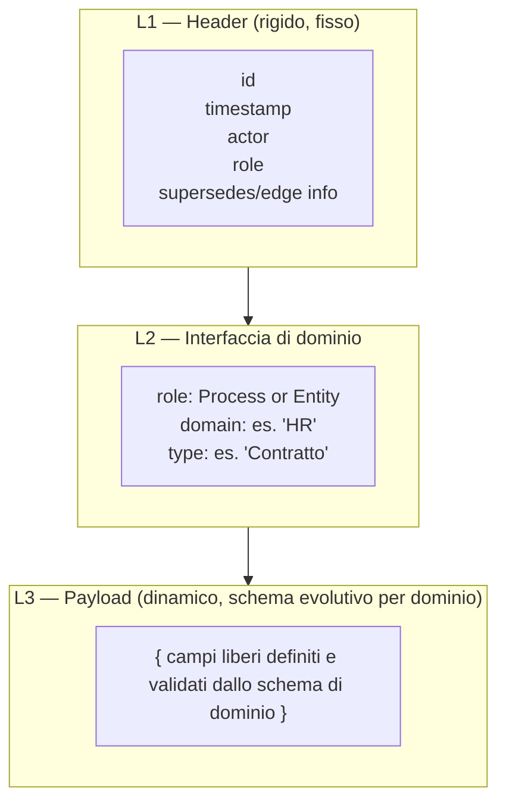
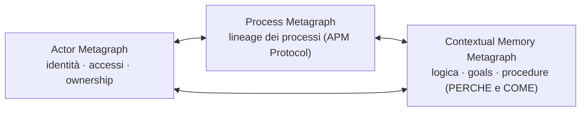
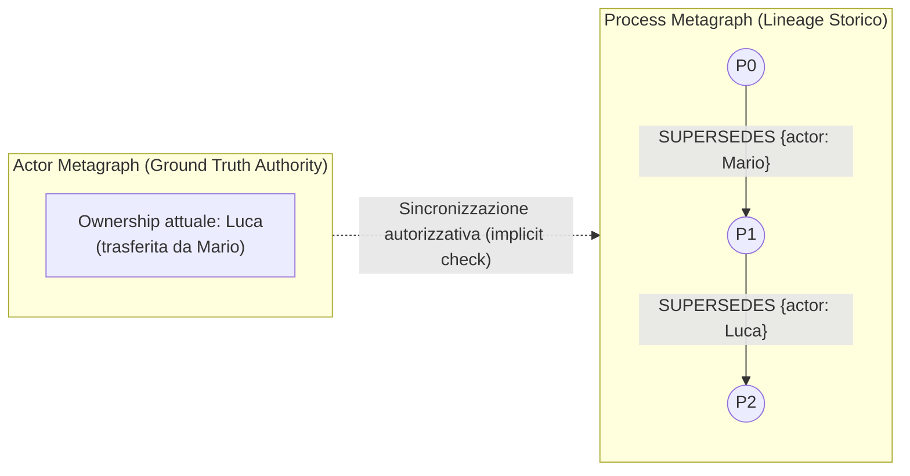

# APM: Adaptive Process Management

### APM Manifesto: Architettura protocol-oriented per la collaborazione Human-Agent

> **Come è organizzato questo documento.** Questo è il documento master di APM: contiene la visione strategica, l'architettura ad alto livello, le relazioni tra i macro-componenti e le considerazioni di compliance globale. I dettagli tecnici specifici di ciascun metagrafo sono delegati agli altri file della wiki, disponibili nell'indice finale.

---

## Executive Summary

APM (Adaptive Process Management) è un protocollo di tracciamento dei processi aziendali, che utilizza pattern ingegneristici già consolidati e maturi:
- La separazione protocollare del contenuto tipica dei sistemi di comunicazione a schema dinamico
- Il principio di stato immutabile e versionato dell'*event sourcing*
- I criteri di elasticità e resilienza del *Reactive Manifesto*
- Il modello di provenienza *entity–activity–agent* di **W3C:PROV-O**

APM risponde a una domanda semplice ma cruciale per ogni organizzazione che integra persone e agenti AI nei propri flussi di lavoro: **chi ha fatto cosa, su cosa, quando e con quale autorità.**

L'infrastruttura poggia su **tre grafi complementari**:

- **Actor Metagraph**: la *ground truth* di identità, permessi (RBAC/ABAC) e ownership;
- **Process Metagraph**: il cuore del protocollo, il lineage immutabile e append-only che traccia l'evoluzione dei processi, cosa è stato consumato o prodotto, e chi lo ha eseguito;
- **Contextual Memory Metagraph**: lo strato logico-procedurale che cataloga il *perché* (Context Graph) delle decisioni e il *come* (Memory Graph) delle procedure applicate; per ogni progetto si crea un nuovo metagrafo o si estende uno preesistente, per dare le linee guida procedurali e operative al team e documentare ogni scelta effettuata durante il processo.

Il valore di business è duplice. Da un lato, APM fornisce un audit trail assoluto e non ripudiabile per ogni azione (umana o agentica), con piena tracciabilità di deleghe, esecuzioni concorrenti e rollback, riducendo il rischio operativo e semplificando la compliance normativa (incluso il GDPR). Dall'altro, separa nettamente ciò che è fisso nel protocollo (due sole primitive: **Process** ed **Entity**) da ciò che è specifico di ogni reparto (schemi di dominio evolutivi), permettendo a ogni funzione aziendale — HR, Finance, Prodotto, Sviluppo... — di adottare lo stesso protocollo senza mai dover coordinare modifiche al core.

APM può essere visto come un layer di coordinamento leggero che riutilizza e ricompone standard esistenti sopra un'organizzazione, lasciando inalterato il sistema aziendale sottostante e demandando al personale tecnico l'analisi e le scelte implementative per l'integrazione.

---

## 0. Visione

APM è l'infrastruttura di supporto ai processi aziendali: un protocollo unico, leggero ed estendibile che traccia **chi ha fatto cosa, su cosa, perché e come**, in ogni reparto, per ogni collaborazione tra persone e agenti AI.

Non è un'invenzione da zero: sfrutta standard esistenti e li mette insieme in modo unico — la separazione del contenuto per sistemi a schema dinamico, l'idea di stato immutabile e versionato (event sourcing), i principi di elasticità e resilienza del *Reactive Manifesto*, e il modello di provenienza *entity–activity–agent* di **W3C:PROV-O**, ridefinito come **Entity–Process–Actor**.

Il risultato è un **metamodello fisso nelle sue regole invarianti, ma a schema evolutivo per la semantica di dominio**: poche regole compilate nel core, sopra le quali ogni reparto costruisce e fa evolvere i propri modelli dati tramite schemi registrati, senza mai toccare il protocollo.

---

## 1. Design Comunicativo: Filosofia a struttura base fissa + semantica evolutiva

APM non definisce anzitutto "la forma di un nodo del grafo" o "la forma del pacchetto di comunicazione" in anticipo: definisce un **protocollo di comunicazione ad alto livello**, espresso tramite tre nuclei informativi concettuali **L1, L2 e L3** che si applicano in modo identico, senza bisogno di uno schema separato, a tre casi d'uso distinti:

1. **Pacchetti di comunicazione**: il formato logico con cui un sistema esterno invia una richiesta di azione verso il protocollo.
2. **Contenuto per eventi e direttive/operazioni**: il corpo informativo che descrive un intento operativo (es. "crea questo Process", "fai avanzare questo Process con `SUPERSEDES`", "collega questa Entity"), a prescindere dal canale con cui viaggia.
3. **Informazioni del grafo da persistere**: la forma finale con cui il nodo/arco viene scritto e reso interrogabile nel Process Metagraph.

È importante distinguere qui il **Modello Dati Concettuale** dal **Modello Implementativo**: L1/L2/L3 sono nuclei concettuali invarianti, che devono essere adattati caso per caso allo specifico contesto in cui vengono impiegati. Il manifesto fissa solo l'invariante concettuale, non il *come* implementarlo.

Ogni unità dati è quindi composta da tre livelli. Solo il primo è "compilato" nel protocollo; gli altri sono validati a runtime contro uno schema registrato — aggiungere o aggiornare un dominio non tocca mai il core.

* **L1 Header rigido:** contiene le informazioni essenziali per la consistenza del sistema, come `id`, `timestamp`, `actor`, `role`, ... È l'unica parte realmente "compilata" nel protocollo.
* **L2 Interfaccia di dominio:** dichiara a quale dominio e tipo appartiene il pacchetto (`role: Process` o `Entity`, `domain`, `type`), permettendo al ricevente — sia esso il sistema in fase di persistenza, sia un altro sistema in fase di comunicazione — di sapere contro quale schema validare L3.
* **L3 Payload dinamico:** il contenuto libero, validato a runtime contro lo schema di dominio registrato. Nel caso della persistenza a grafo, il payload L3 può contenere, in base alla strategia di dominio adottata, **un riferimento (`ref`) puntatore verso il Data Plane, oppure il contenuto inline**. L'opzione inline resta concettualmente sconsigliata per un protocollo di lineage puro: appesantisce il Control Plane con dati che non gli competono (§8) e va riservata a metadati compatti o a casi eccezionali normati dal dominio.

A livello compilato, `role` ammette **solo due valori primitivi**: `Process` o `Entity`. Nessun altro tipo di nodo esiste mai nel metamodello. Anche le dinamiche di concorrenza, delega e versioning (§5, §6) si appoggiano esclusivamente su nodi Process ed Entity.

> **Nota applicativa, Schema di dominio:** il reparto HR definisce uno schema L3 per il tipo `Contratto` (campi: durata, RAL, clausole) e lo registra nel protocollo. Il reparto Finance, in parallelo, definisce il proprio schema per `Fattura`. Nessuno dei due tocca L1/L2: entrambi restano validi contro lo stesso header fisso, evolvendo autonomamente il proprio payload.

### Idempotenza contestuale sulle operazioni critiche

**Garanzia di protezione sulle operazioni sensibili o irreversibili** (es. approvazioni finanziarie, ordini di pagamento, emissioni di documenti ufficiali, notifiche vincolanti cross-dominio).

Per queste specifiche operazioni, l'applicazione reiterata dello stesso evento asincrono — causata da retry di rete o ridondanza agentica — non deve mai generare duplicazioni indesiderate di nodi o archi nel grafo. La distinzione tra una riesecuzione intenzionale di un comando e la duplicazione tecnica di un messaggio, così come le relative chiavi di deduplica, è gestita dal livello applicativo; il manifesto stabilisce il principio che **il grafo di processo deve riflettere l'intenzione di business senza produrre effetti collaterali critici duplicati**.

## 2. Architettura a tre grafi

L'infrastruttura aziendale poggia su tre grafi distinti, ciascuno con una responsabilità unica.

* **Actor Metagraph**: è la **Ground Truth** per identità, ruoli, permessi (RBAC/ABAC) e **ownership**. Determina chi ha l'autorità di eseguire o approvare un'azione. Dettagli in [ActorMetagraph](./ActorMetagraph.md).
* **Process Metagraph**: il grafo di *lineage*, cuore tecnico del protocollo: traccia l'evoluzione degli stati, la provenienza degli output e la storia delle azioni eseguite. Risponde al **COSA** (cosa è stato fatto, cosa è stato usato, cosa è stato prodotto) e al **CHI** (quali attori umani e agentici hanno operato). Dettagli in [ProcessMetagraph](./ProcessMetagraph.md).
* **Contextual Memory Metagraph**: la base logica e procedurale dell'infrastruttura: rappresenta il **PERCHÉ** (scopi, goal, principi), il **COME** (logica applicata, skill, procedure) e il contesto decisionale che ha guidato le azioni tracciate nel Process Metagraph. È complementare e potenzialmente unificabile col Process Metagraph in un sistema interconnesso. Dettagli in [ContextualMemoryMetagraph](./ContextualMemoryMetagraph.md).

> **Esempi-base illustrativi delle relazioni tra i tre grafi**:
> - **Actor ↔ Process:** prima di scrivere un arco `SUPERSEDES`, il protocollo verifica contro l'Actor Metagraph che l'attore abbia il permesso di operare su quel Process.
> - **Process ↔ Contextual Memory:** un Process può portare un riferimento esplicito a un Decision Point nella Contextual Memory Metagraph che ne motiva l'esito — perché è stato fatto in quel modo, con quale procedura — senza fondere i due grafi.
> - **Actor ↔ Contextual Memory:** quando un principio o una procedura operativa viene modificata o versionata nella Contextual Memory Metagraph per uno specifico progetto, è richiesta l'accettazione esplicita di un attore autorizzato (verificato contro l'Actor Metagraph) prima che la nuova versione del principio diventi effettiva.

### 1.1 Distinzione concettuale: Process vs Contextual Memory Metagraph

| Aspetto | Process Metagraph | Contextual Memory Metagraph |
| --- | --- | --- |
| **Responsabilità** | Traccia *cosa* è accaduto e *chi* lo ha fatto | Cataloga *perché* è accaduto e *come* è stato deciso |
| **Natura del dato** | Immutabile, append-only, cronologico | Evolutivo, procedurale, logico-contestuale |
| **Interrogazioni tipiche** | "Quale entità è stata usata?" "Chi ha eseguito questa azione?" "Quali step hanno portato a questo output?" | "Quale principio ha guidato questa decisione?" "Quale skill o procedura è stata applicata?" "Quale era l'intento del processo?" |
| **Uso in audit** | Traccia storica irrefutabile | Contesto e razionale delle decisioni |

**Unificazione potenziale**: i due grafi possono essere accorpati in modo parziale o totale in un sistema interconnesso (opzioni di integrazione con relativi trade-off in [ContextualMemoryMetagraph](./ContextualMemoryMetagraph.md)).

---

## 3. Relazioni tra i Macro-Componenti: Attribuzione e Ownership

Il Process Metagraph resta **puro lineage storico**: traccia *chi ha eseguito* un'azione al tempo *t*, non chi *possiede* il processo nel presente.

Ogni arco porta con sé il riferimento all'`actor` che ha firmato la transazione. La titolarità legale o organizzativa del processo (**Ownership**) risiede esclusivamente nell'**Actor Metagraph** (Ground Truth).

### Meccanismo di sincronizzazione e invarianti

1. **Trasferimento di Ownership:** quando un responsabile trasferisce la titolarità nell'Actor Metagraph, l'autorizzazione dell'attore precedente viene revocata alla fonte.
2. **Tracciabilità implicita sul grafo:** il cambio si riflette nel Process Metagraph in modo naturale — l'arco successivo sarà firmato dall'`actor` del nuovo titolare.
3. **Invariante di audit:** il Process Metagraph è append-only. Gli eventi storici firmati dal vecchio attore rimangono immutabili e validi per l'audit passato; le nuove operazioni saranno consentite solo al nuovo titolare validato contro l'Actor Metagraph.

> **Nota applicativa, trasferimento di ownership:** un ticket di incident IT viene aperto da Marco (`actor: Marco`) e portato avanti tramite una catena di `SUPERSEDES`. Quando il ticket viene riassegnato a Giulia, l'Actor Metagraph aggiorna l'ownership; il prossimo `SUPERSEDES` sarà firmato `actor: Giulia`. Gli archi storici firmati da Marco restano immutabili e consultabili in audit.

---

## 4. Sintesi dei Rischi e Mitigazioni Concettuali

| Rischio Concettuale | Mitigazione di Protocollo |
| --- | --- |
| Sovraccarico cognitivo da tracciamento agentico esteso | Proiezione separata: Macro-vista lineare (`SUPERSEDES`) per business/audit; Micro-vista (`SPAWN`/`FORK`) solo su richiesta. |
| Disallineamento tra Autorizzazione e Lineage | Actor Metagraph come Ground Truth: revoca immediata delle autorizzazioni alla fonte con firma univoca dell'attore sugli archi. |
| Incoerenza legale/GDPR in sistemi immutabili append-only | Pseudonimizzazione nell'Actor Metagraph e crypto-shredding dei payload sensibili nel Data Plane. |
| Sovraccarico del grafo di processo | APM nasce come metagrafo leggero, con separazione netta dal Data Plane: log agentici e payload complessi relegati a storage esterni referenziati. |
| Ambiguità nel tracciamento di esecuzioni concorrenti | Distinzione chiara tra convergenze di dati (`JOIN` tra Entity) e avanzamento temporale di processo (`SUPERSEDES`). |
| Confusione tra tracciamento fattuale e logica decisionale | Separazione concettuale tra Process Metagraph (COSA/CHI) e Contextual Memory Metagraph (PERCHÉ/COME); potenzialmente unificabili in sistemi interconnessi. |
| Indeterminismo su quale ramo è "vincitore" in processi divergenti | I branch rimangono tracciati come traiettorie parallele nel grafo. La decisione di convergenza avviene tramite `JOIN` su Entity, mai via `SUPERSEDES` tra branch. La scelta logica del ramo vincente risiede esclusivamente nella Contextual Memory Metagraph. |

---

## 5. Compliance e Governance Trasversale

### 5.1 Diritto all'Oblio e GDPR

In ottemperanza alle normative sul trattamento dei dati personali (es. GDPR Art. 17 - Diritto all'Oblio), l'immutabilità e la natura append-only del Process Metagraph sono bilanciate da precise garanzie nell'Actor Metagraph e nel Data Plane:

1. **Anonymization & Crypto-Shredding:** nessun dato identificativo personale (PII) risiede in chiaro nei nodi del Process Metagraph. Gli identificativi degli attori fanno riferimento a entità dell'Actor Metagraph.
2. **Gestione del Diritto all'Oblio:** in caso di cancellazione di un utente, l'Actor Metagraph storicizza o anonimizza l'identità dell'attore (es. pseudonimizzazione o distruzione della chiave di cifratura associata), garantendo l'integrità strutturale del lineage storico per scopi di audit senza violare la legge.

> **Nota applicativa, Diritto all'oblio:** un dipendente richiede la cancellazione dei propri dati. L'Actor Metagraph pseudonimizza l'identità dell'attore (o distrugge la chiave di cifratura associata) sostituendo i riferimenti PII; gli archi storici del Process Metagraph restano strutturalmente intatti e interrogabili in audit, senza esporre più l'identità reale.

### 5.2 Governance dei Domini

La governance degli schemi è decentralizzata per responsabilità ma controllata nell'esecuzione:

* **Responsabilità di Dominio:** il Tech Lead o Dominio Owner definisce e fa evolvere gli schemi `(domain, role, type)` del proprio reparto e stabilisce le policy di archiviazione dei dati.
* **Validazione ed Esecuzione:** la registrazione degli schemi nel registro di protocollo e le operazioni con privilegi sul metagrafo sono eseguite tramite meccanismi centralizzati che garantiscono la consistenza globale della rete.
* **Retrocompatibilità degli Schemi:** l'evoluzione di uno schema di dominio è sempre retrocompatibile con i vecchi dati: si può registrare una nuova versione dello schema affiancandola a quella precedente, o anche sostituirlo, ma tenendo presente che i vecchi dati ingeriti avevano un altro schema; uno schema esistente non viene mai rimosso né sostituito in modo distruttivo. I payload già validati contro versioni precedenti restano validi e interrogabili.

---

## Appendice: Standard di Riferimento e Terminologia

Il vocabolario e alcuni principi architetturali di APM si appoggiano a standard e pattern già consolidati nel settore.

| Standard / Pattern | Cosa fornisce ad APM |
| --- | --- |
| **PROV-O** (W3C Provenance Ontology) | Il modello concettuale Entity–Activity–Agent, riletto in APM come Entity–Process–Actor. |
| **Reactive Manifesto** | I principi di elasticità, resilienza e reattività agli eventi che ispirano l'architettura a grafi disaccoppiati. |
| **Event Sourcing** | Il pattern di stato immutabile e versionato, alla base della natura append-only del Process Metagraph. |
| **Schema Registry** | Il pattern di registrazione centralizzata degli schemi di dominio con evoluzione controllata e retrocompatibile. |
| **RBAC / ABAC** (Role-Based / Attribute-Based Access Control) | I modelli di controllo accessi su cui si fonda l'Actor Metagraph come Ground Truth di identità e permessi. |
| **GDPR** (Regolamento UE 2016/679) | Il quadro normativo per la protezione dei dati personali, in particolare l'Art. 17 (Diritto all'Oblio). |

---

## Indice dei Metagrafi

La lettura dei tre documenti modulari non richiede un ordine vincolante; di seguito la sequenza logica consigliata per una prima comprensione end-to-end dell'infrastruttura:

1. **[ActorMetagraph](./ActorMetagraph.md)** — identità, permessi e ownership (Ground Truth)
2. **[ContextualMemoryMetagraph](./ContextualMemoryMetagraph.md)** — il perché e il come delle decisioni (Goal, Principle, Skill, Decision Point)
3. **[ProcessMetagraph](./ProcessMetagraph.md)** — il lineage dei processi: protocollo, primitive ed evoluzione agentica