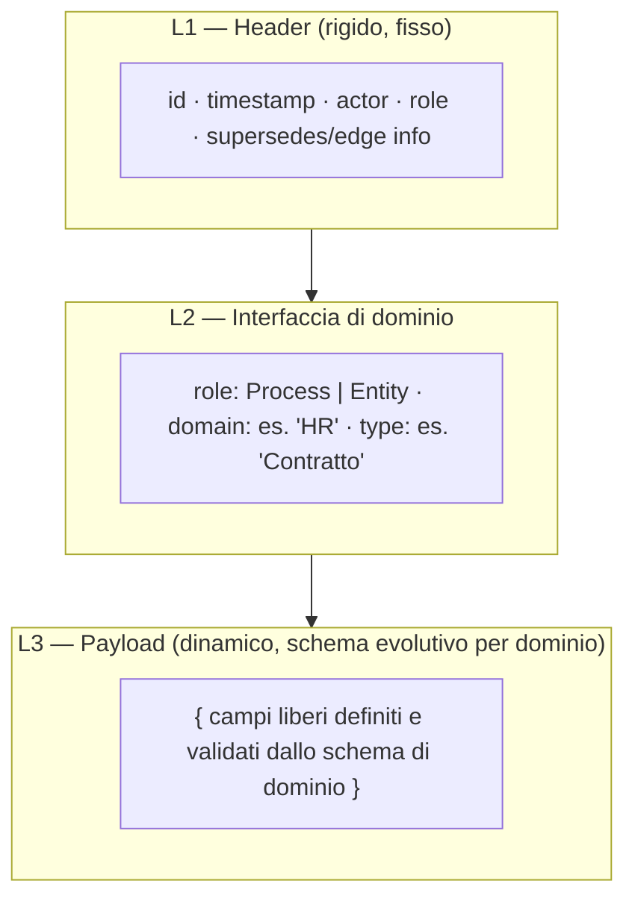
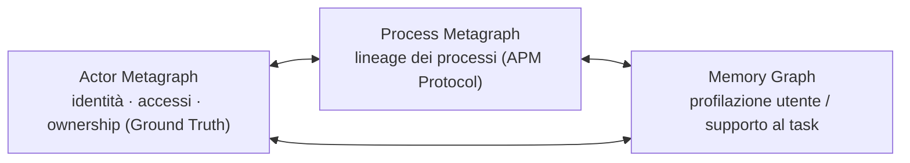
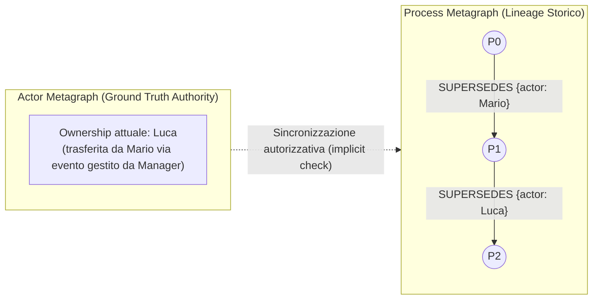
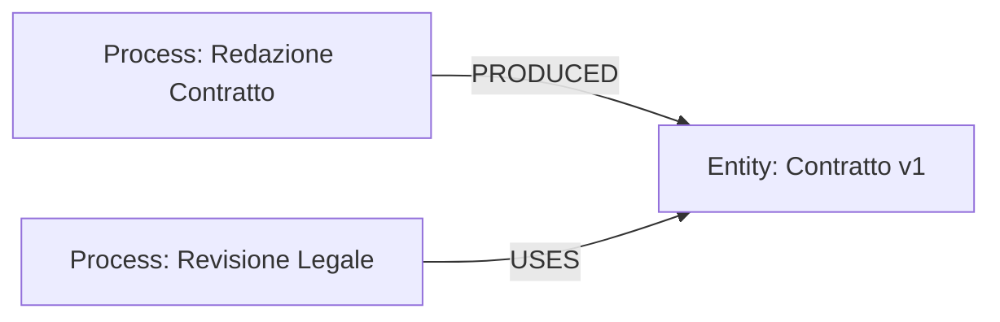
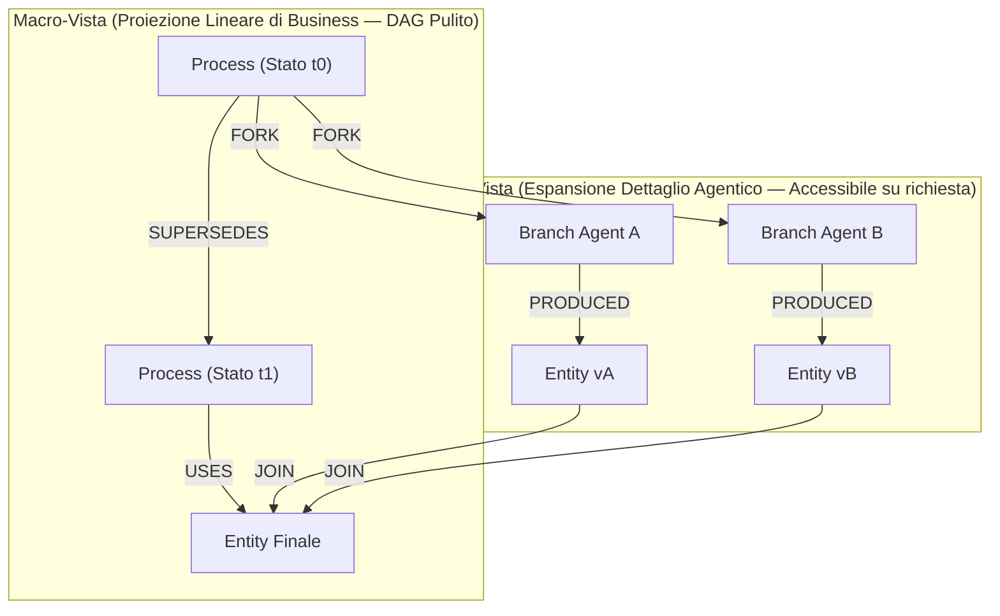
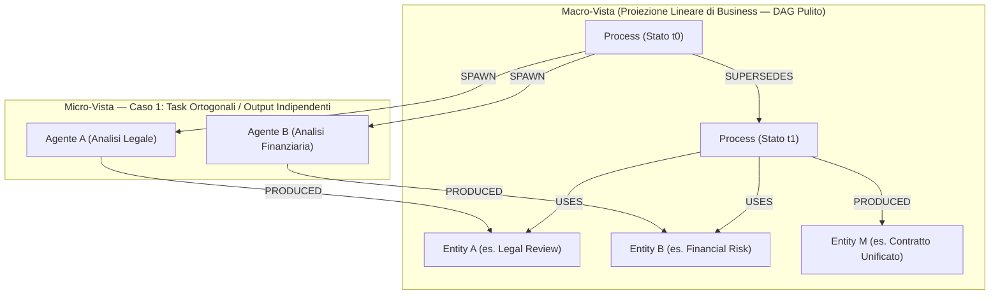
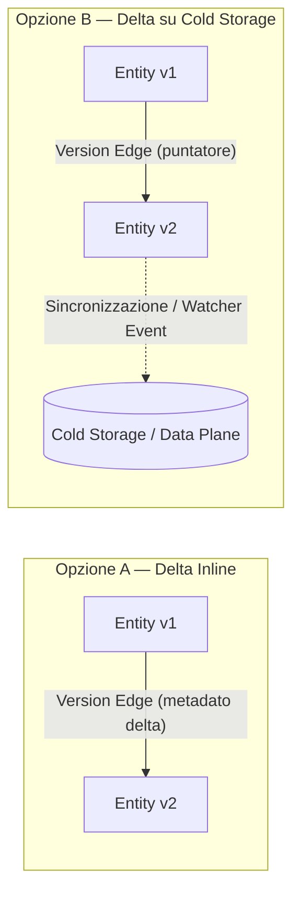
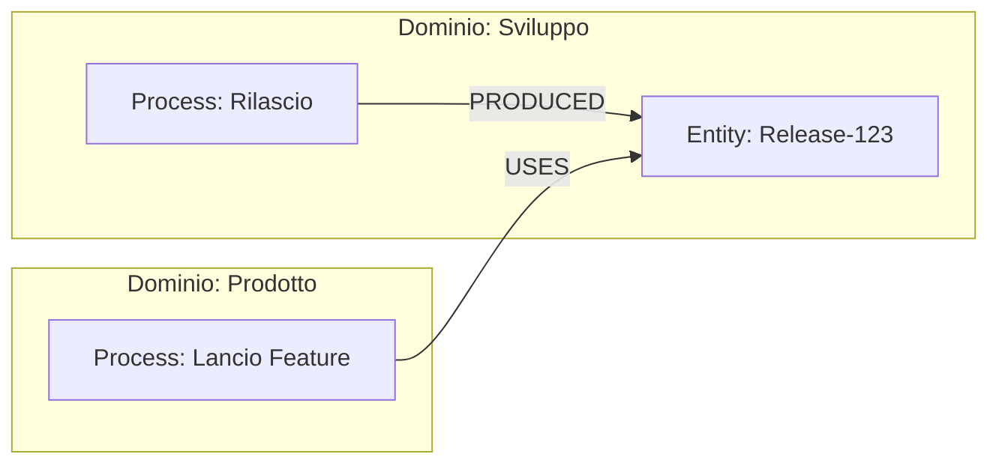
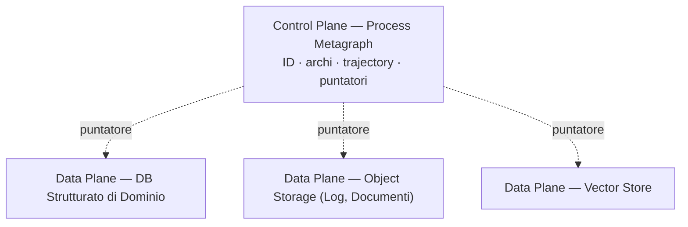
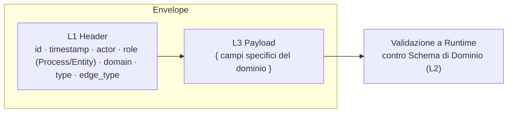

# APM — Adaptive Process Management

### Manifesto v4.1 — Architettura protocol-oriented per la collaborazione Human-Agent

---

## 0. Visione

APM è l'infrastruttura di supporto ai processi aziendali: un protocollo unico, leggero ed estendibile che traccia **chi ha fatto cosa, su cosa, e perché**, in ogni reparto, per ogni collaborazione tra persone e agenti AI.

Non è un'invenzione da zero, ma una sintesi deliberata di idee già validate altrove: la separazione struttura/contenuto dei sistemi a schema dinamico, l'idea di stato immutabile e versionato (event sourcing), i principi di elasticità e resilienza del *Reactive Manifesto*, e il modello di provenienza *entità–attività–agente* di **PROV-O**, riletto qui come **Entity–Process–Actor**.

Il risultato è un **metamodello fisso nelle sue regole invarianti, ma a schema evolutivo per la semantica di dominio**: poche regole compilate nel core, sopra le quali ogni reparto costruisce e fa evolvere i propri modelli dati tramite schemi registrati, senza mai toccare il protocollo.

---

## 1. Filosofia di design: struttura fissa, semantica evolutiva

Ogni nodo del grafo è composto da tre livelli. Solo il primo è "compilato" nel protocollo; gli altri sono validati a runtime contro uno schema registrato — aggiungere o aggiornare un dominio non tocca mai il core.

A livello compilato, `role` ammette **solo due valori primitive**: `Process` o `Entity`. Nessun altro tipo di nodo esiste mai nel metamodello. Anche le dinamiche di concorrenza, delega e versioning (§6, §7) si appoggiano esclusivamente su nodi Process ed Entity.

### Idempotenza contestuale sulle operazioni critiche

L'idempotenza non è un vincolo cieco applicato a qualsiasi scrittura, ma una **garanzia di protezione sulle operazioni sensibili o irreversibili** (es. approvazioni finanziarie, ordini di pagamento, emissioni di documenti ufficiali, notifiche vincolanti cross-dominio).

Per queste specifiche operazioni, l'applicazione reiterata dello stesso evento asincrono — causata da retry di rete o ridondanza agentica — non deve mai generare duplicazioni indesiderate di nodi o archi nel grafo. La distinzione tra una riesecuzione intenzionale di un comando e la duplicazione tecnica di un messaggio, così come le relative chiavi di deduplica, è gestita dagli Handler applicativi nel Data Plane; il manifesto stabilisce il principio che **il grafo di processo deve riflettere l'intenzione di business senza produrre effetti collaterali critici duplicati**.

---

## 2. Architettura a tre grafi

L'infrastruttura aziendale poggia su tre grafi distinti, ciascuno con una responsabilità unica. Solo il secondo — il **Process Metagraph** — è il cuore del protocollo APM; gli altri due sono pilastri dell'architettura che restano fuori dallo scopo tecnico del manifesto, implementabili liberamente dalle varie funzioni aziendali.

* **Actor Metagraph** — è la **Ground Truth** per identità, ruoli, permessi (RBAC/ABAC) e **ownership**. Determina chi ha l'autorità di eseguire o approvare un'azione.
* **Process Metagraph** — il grafo di *lineage*, oggetto di questo manifesto: traccia l'evoluzione degli stati, la provenienza degli output e la storia delle azioni eseguite.
* **Memory Graph** — **memoria agentica** per il supporto al task: skill, preferenze, contesto di sessione e cronologia dei progetti che un agente usa per assistere l'utente. Non alimenta mai valutazioni disciplinari o di performance.

---

## 3. Glossario essenziale

| Termine | Significato |
| --- | --- |
| **Process Node** | Uno stato specifico al tempo *t* (equivalente a un'Activity PROV-O). Immutabile: ogni cambio di stato crea un nuovo nodo. |
| **Entity Node** | Un dato (input, output o arricchimento) collegato a un Process tramite `USES` o `PRODUCED`. |
| **Process Edge (`SUPERSEDES`)** | L'arco primario che fa avanzare la linea temporale standard di un processo da uno stato al successivo. |
| **Entity Edge (`USES` / `PRODUCED`)** | Collega una Entity a un Process: cosa è stato consumato, cosa è stato generato. |
| **Spawn Edge (`SPAWN`)** | Collega un Process all'esecuzione di un subprocesso delegato in background, compattato in un log unico. |
| **Fork Edge (`FORK`)** | Arco di ramificazione esplicita da un Process verso N branch concorrenti e isolati (traiettorie parallele). |
| **Join/Merge Edge (`JOIN`)** | Arco di convergenza che unisce N Entity prodotte da branch concorrenti in un'unica Entity finale dello stesso tipo delle sorgenti. Formalmente agisce come relazione N-a-1 (Hyperedge relazionale) per consolidare i risultati. |
| **Conflict Edge (`CONFLICT`)** | Arco che rende esplicita nel grafo una collisione tra scritture concorrenti incompatibili sulla stessa Entity logica. |
| **Version Edge** | Arco tra stati (Process o Entity) che esprime la relazione di revisione con il tracciamento del *delta* del cambiamento (inline o via puntatore). |
| **Derived Edge (`DERIVED_FROM`)** | Ponte logico marginale e opzionale tra Entity, definito caso per caso dal dominio. |
| **Actor** | Proprietà presente sull'arco che indica l'identità dell'esecutore che ha effettuato la scrittura. |
| **`acting_on_behalf_of`** | Proprietà opzionale sull'arco: indica l'attore per conto del quale è stata eseguita l'azione. |
| **Process Trajectory** | La catena ordinata di Process Node collegati da `SUPERSEDES`. |

---

## 4. Attribuzione e Ownership: disaccoppiamento controllato

Il Process Metagraph resta **puro lineage storico**: traccia *chi ha eseguito* un'azione al tempo *t*, non chi *possiede* il processo nel presente.

Ogni arco porta con sé il riferimento all'`actor` che ha firmato la transazione. La titolarità legale o organizzativa del processo (**Ownership**) risiede esclusivamente nell'**Actor Metagraph** (Ground Truth).

### Meccanismo di Sincronizzazione e Invarianti

1. **Trasferimento di Ownership:** Quando un manager o responsabile trasferisce la titolarità nell'Actor Metagraph, l'autorizzazione dell'utente precedente viene revocata alla fonte.
2. **Tracciabilità Implicita sul Grafo:** Il cambio si riflette nel Process Metagraph in modo naturale: l'arco successivo sarà firmato dall'`actor` del nuovo titolare.
3. **Invariante di Audit:** Il Process Metagraph è append-only. Gli eventi storici firmati dal vecchio attore rimangono immutabili e validi per l'audit passato; le nuove operazioni saranno consentite solo al nuovo titolare validato contro l'Actor Metagraph.

---

## 5. Ruoli contestuali delle Entity

Un'Entity non ha una tipologia rigida di utilizzo: il ruolo è strettamente relativo all'arco che la collega a un Process. Lo stesso oggetto dati può essere l'output di una fase di redazione e l'input di una fase di revisione senza subire alcuna riassegnazione strutturale.

---

## 6. Tracciamento Agentico: la Proiezione a Solido DAG

La collaborazione con agenti AI richiede un modello flessibile che non vincoli l'orchestrazione a una forma rigida predefinita. **Non esiste il requisito di un lineage omogeneo**: l'infrastruttura si adatta a scenari che vanno dalla delega lineare semplice a complessi grafi di esecuzione concorrente.

Nonostante l'orchestrazione agentica introduca rami paralleli e convergenze, **il metamodello garantisce l'assenza assoluta di cicli temporali (Acyclic Flow)**.

### Proiezione per livelli di astrazione (Macro vs. Micro)

Per evitare che l'utente finale o il revisore di business vengano sommersi dalla complessità delle chiamate agentiche intermedie, APM applica il principio di **Proiezione del Grafo**:

1. **Macro-Vista (Linear Process Projection):** Filtrando il grafo per le sole relazioni `SUPERSEDES` ed Entity finali, si ottiene un **DAG lineare e pulito**. Questo è il livello mostrato all'utente o all'auditor per validare il risultato di business (*"Cosa è stato fatto e da chi"*).
2. **Micro-Vista (Agentic Workflow Expansion):** I rami generati da `SPAWN` e `FORK` costituiscono la traccia di dettaglio. Vengono consultati o espansi **solo su richiesta esplicita** (es. controlli di conformità approfonditi, debugging da parte di AI Engineer, analisi di alignment degli agenti).

### Le Primitive di Delega e Concorrenza

* **`SPAWN` (Delega lineare compattata):** Usato quando un agente riceve un sotto-task delimitato. L'intera esecuzione interna (ragionamenti, tool calls) vive isolata ed è compattata in un log di esecuzione archiviato nel Data Plane. Il metagrafo vede un singolo nodo e l'Entity di output prodotta.
* **`FORK` (Concorrenza esplicita):** Usato quando l'orchestrazione richiede la ramificazione in traiettorie parallele visibili a livello di metagrafo. Ogni ramo opera in una propria **sandbox concettuale** elaborando una propria versione/ipotesi di lavoro in base al suo specifico goal.
* **`JOIN` (Convergenza relazionale / Hyperedge):** Quando i rami concorrenti debbono riconvergere, il `JOIN` consolida le Entity sorgenti ($E_A, E_B$) in un'unica Entity finale $E_{final}$ dello stesso tipo. Dal punto di vista del metamodello, il `JOIN` agisce come una relazione di convergenza N-a-1 tra Entity (strutturalmente equivalente a un Hyperedge sulle relazioni), senza introdurre nodi di tipo "Process Collettore" inutili.
* **`CONFLICT`:** Evidenzia esplicitamente una collisione non riconciliabile tra rami concorrenti, instradandola a un handler o alla decisione umana.

La scelta tra usare `SPAWN` o `FORK` può essere determinata a priori dalle regole del dominio o decisa dinamicamente dall'agente orchestratore. L'invariante di protocollo è una sola: **qualsiasi processo agentico in background deve essere tracciato e riconducibile alla sua origine.**

---

## 7. Versioning e Gestione dei Delta

Un cambio di stato può necessitare del solo tracciamento della supersessione (`SUPERSEDES`) o della registrazione puntuale di *cosa* è cambiato. La relazione di versione è gestita dal **Version Edge**.

Il delta del cambiamento risponde alla netta separazione tra **Control Plane** (Process Metagraph) e **Data Plane** (Storage di dominio):

* **Delta Inline (Control Plane):** Per variazioni strutturali minime e metadati compatti, il delta risiede direttamente sull'arco nel metagrafo.
* **Delta in Cold Storage (Data Plane):** Per modifiche estese o documenti complessi, l'arco contiene la relazione logica e il puntatore ai dati nello storage esterno.

Le policy su dove archiviare i delta (soglie di dimensione, frequenza) e l'eventuale reattività tramite watcher ed eventi di sistema sono scelte operative definite nel manuale tecnico in base ai requisiti dell'infrastruttura software adottata.

---

## 8. Unificazione cross-dominio

Domini differenti non condividono i propri modelli dati interni, ma condividono lo **spazio degli identificatori canonici**. Due processi di reparti diversi si collegano in modo trasparente e transitivo referenziando la medesima Entity immutabile.

---

## 9. Control Plane vs Data Plane

Il Process Metagraph agisce come **Control Plane**: un'infrastruttura ad alta velocità che contiene unicamente identificativi, archi, attributi dell'envelope e puntatori. Il contenuto effettivo (payload pesanti, log estesi di esecuzione, vettori, documenti) risiede nel **Data Plane**.

---

## 10. Envelope del Protocollo

Ogni transazione sul metagrafo avviene tramite un **Envelope** rigido nel tracciato L1, combinato con un payload L3 libero ma validato:

---

## 11. Conformità Normativa e Protezione Dati (GDPR)

In ottemperanza alle normative sul trattamento dei dati personali (es. GDPR Art. 17 - Diritto all'Oblio), l'immutabilità e la natura append-only del Process Metagraph sono bilanciate da precise garanzie nell'Actor Metagraph e nel Data Plane:

1. **Anonymization & Crypto-Shredding:** Nessun dato identificativo personale (PII) risiede in chiaro nei nodi del Process Metagraph. Gli identificativi degli attori fanno riferimento a entità dell'Actor Metagraph.
2. **Gestione del Diritto all'Oblio:** In caso di cancellazione di un utente, l'Actor Metagraph storicizza o anonimizza l'identità dell'attore (es. pseudonimizzazione o distruzione della chiave di cifratura associata), garantendo l'integrità strutturale del lineage storico per scopi di audit senza violare la legge.

---

## 12. Governance dei Domini

La governance degli schemi è decentralizzata per responsabilità ma controllata nell'esecuzione:

* **Responsabilità di Dominio:** Il Tech Lead o Dominio Owner definisce e fa evolvere gli schemi `(domain, role, type)` del proprio reparto e stabilisce le policy di archiviazione dei dati (L3).
* **Validazione ed Esecuzione:** La registrazione degli schemi nel registro di protocollo e le operazioni con privilegi sul metagrafo sono eseguite tramite meccanismi centralizzati che garantiscono la consistenza globale della rete.

---

## 13. Sintesi dei Rischi e Mitigazioni Concettuali

| Rischio Concettuale | Mitigazione di Protocollo |
| --- | --- |
| Sovraccarico cognitivo da tracciamento agentico esteso | Proiezione separata: Macro-vista lineare (`SUPERSEDES`) per business/audit; Micro-vista (`SPAWN`/`FORK`) solo su richiesta. |
| Disallineamento tra Autorizzazione e Lineage | Actor Metagraph come Ground Truth: revoca immediata delle autorizzazioni alla fonte con firma univoca dell'attore sugli archi. |
| Incoerenza legale/GDPR in sistemi immutabili append-only | Pseudonimizzazione nell'Actor Metagraph e Crypto-Shredding dei payload sensibili nel Data Plane. |
| Sovraccarico del grafo di processo (Control Plane) | Separazione netta dal Data Plane: log agentici e payload complessi relegati a storage esterni referenziati. |
| Ambiguità nel tracciamento di esecuzioni concorrenti | Distinzione chiara tra convergenze di dati (`JOIN` tra Entity) e avanzamento temporale di processo (`SUPERSEDES`). |

---

## 14. Chiusura

APM v4.1 si conferma come una **architettura minimale e concettualmente solida**: tre grafi con responsabilità distinte, un metamodello a sole due primitive fisiche (`Process` ed `Entity`), e un modello di tracciamento che bilancia la flessibilità dell'orchestrazione agentica con la chiarezza richiesta dai processi aziendali.

Lasciando al manuale tecnico la definizione dei driver di storage, dei motori di database a grafo (es. modellazione tramite property graph / hyperedge) e delle chiavi di protocollo, il manifesto fissa **i principi invarianti** su cui costruire la collaborazione trasparente e sicura tra persone e intelligenze artificiali.