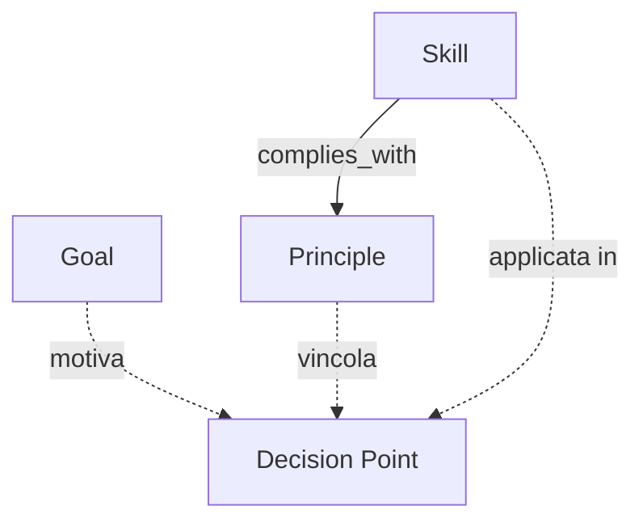
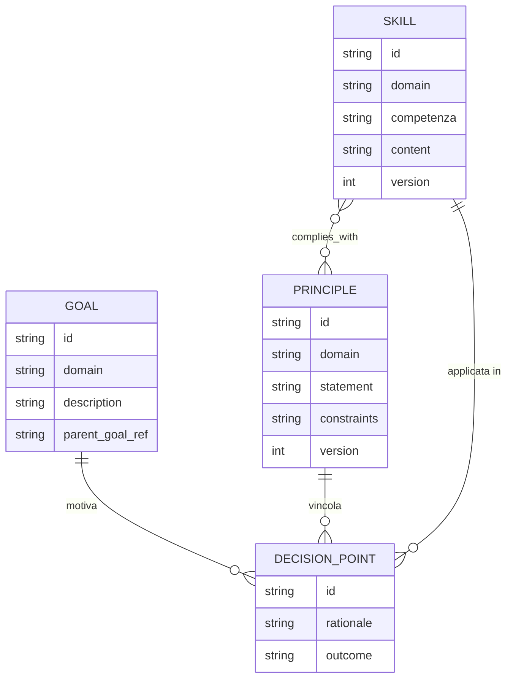

# Contextual Memory Metagraph

> Documento modulare dell'infrastruttura APM. Per la visione d'insieme, l'architettura a tre grafi e le considerazioni di compliance globale, vedi il documento master [APM](./APM.md). Per la distinzione concettuale sintetica rispetto al Process Metagraph, vedi la tabella in APM §1.1.
>
> Questo documento raccoglie la proposta attuale relativa alla Contextual Memory Metagraph. La logica descritta va mantenuta intatta: ulteriori approfondimenti ad alto livello verranno integrati successivamente.

La Contextual Memory Metagraph rappresenta lo strato logico-procedurale dell'infrastruttura APM. Mentre il Process Metagraph registra *cosa* è accaduto (il lineage fattuale), la Contextual Memory Metagraph cataloga *perché* è accaduto e *come* è stato deciso, fornendo il contesto logico e la traccia di ragionamento dietro ogni azione.

---

## 1. Responsabilità e Organizzazione

La Contextual Memory Metagraph si organizza attorno a **tre soli nodi concettuali**, ciascuno responsabile di un layer distinto, più un nodo di raccordo:

- **Goal**: rappresenta l'intenzione a monte di un processo, cosa si voleva ottenere. Se serve una gerarchia, è un attributo interno del nodo stesso (un Goal può referenziare un `parent_goal`).
- **Principle**: rappresenta un principio di governance (una regola, una policy di dominio), e opzionalmente i **vincoli operativi che lo caratterizzano**.
- **Skill**: rappresenta la competenza applicata (umana o agentica) per eseguire un'azione; deve essere usata per una specifica procedura ed è assimilabile a una skill.
- **Decision Point**, è il **punto di raccordo**: cattura una decisione critica e referenzia quali Goal, Principle e Skill l'hanno motivata, vincolata o applicata.

---

## 2. Relazioni tra Contextual Memory Metagraph e Process Metagraph

I due grafi restano strutturalmente separati: un Process può referenziare i nodi della Contextual Memory Metagraph, non li contiene, almeno a livello concettuale.

- **Process → Goal**: ogni Process, o una Process Trajectory nel suo insieme, può referenziare il Goal che lo ha originato.
- **Process → Skill**: il Process referenzia la Skill impiegata per la sua esecuzione; la procedura risolta è già leggibile come attributo di quella Skill, senza query aggiuntive.
- **Process → Principle**: il Process referenzia il Principle sotto la cui governance opera; eventuali vincoli specifici sono già leggibili come attributo di quel Principle.
- **Decision Point sui rami divergenti**: quando dal Process Metagraph emergono rami `SUPERSEDES` paralleli e indipendenti (rollback, branch concorrenti), il punto di divergenza referenzia un Decision Point che cataloga quale direzione è stata adottata e perché — cosa che il Process Metagraph, per costruzione, non registra mai.

> **Nota applicativa, branch divergente motivato:** quando da un Process `P0` divergono i branch "feature Alice" e "feature Bob", il Decision Point referenziato da entrambi registra che "feature Alice" è stata adottata perché in linea con il Principle "sicurezza dei dati in transito" (che elenca tra i suoi constraint la cifratura obbligatoria), mentre "feature Bob" è stato scartato. Il Process Metagraph continua a vedere solo due `SUPERSEDES` paralleli.

---

## 3. Interrogazioni e Use Case

- **Auditing logico**: "Quale principio ha guidato questa decisione?" — dal Decision Point al Principle che lo vincolava, inclusi i suoi constraint.
- **Learning**: "Quale skill è stata utilizzata in questo contesto, e per quale procedura?" — la Skill referenziata porta già l'informazione della procedura risolta.
- **Troubleshooting**: "Quale era l'intento originale del processo?" — risale dal Process al Goal referenziato.
- **Governance**: "Quali skill sono conformi al principio P?" — query inversa sulla relazione `complies_with` tra Skill e Principle.
- **Branch analysis**: "Perché è stato scelto il branch A invece del branch B?" — il Process Metagraph fornisce i riferimenti alle due traiettorie, il Decision Point referenziato fornisce il razionale.

---

## 4. Potenziale Unificazione e Sistemi Interconnessi

Process Metagraph e Contextual Memory Metagraph restano concettualmente distinti ma non necessariamente su infrastrutture fisicamente separate. Il manifesto non impone una scelta implementativa, ma delinea tre opzioni con trade-off differenti, da valutare in base alla scala e alla governance del progetto:

**Opzione A — Integrazione completa in un grafo unificato:** Process, Entity e i nodi della Contextual Memory Metagraph convivono nello stesso motore a grafo, con tipi di nodo distinti ma query cross-grafo native. Massimizza la facilità di interrogazione congiunta ("cosa e perché" in una sola query), ma rischia di creare confusione e aumentare la complessità, e può far filtrare la semantica logico-procedurale, evolutiva per natura, dentro il core rigido e immutabile del protocollo.

**Opzione B — Integrazione parziale tramite edge di referenza** (l'approccio illustrato negli esempi di questo capitolo): i due grafi restano fisicamente distinti, ciascuno con il proprio ciclo di vita, collegati da archi di riferimento espliciti (Process → Decision Point, Process → Goal, ecc.). Preserva l'immutabilità del Process Metagraph e la libertà evolutiva della Contextual Memory Metagraph, al costo di una query cross-grafo che deve attraversare esplicitamente il collegamento.

**Opzione C — Mantenimento della separazione con sistema di linking esplicito:** i due grafi non condividono nemmeno l'infrastruttura di riferimento diretto; il collegamento avviene tramite un livello applicativo esterno (un indice, un servizio di lookup) che mappa identificatori tra i due sistemi. Massima indipendenza operativa e possibilità di adottare approcci diversi per i due grafi, al prezzo di una minore garanzia di consistenza referenziale tra i due lati del link.

La scelta tra le tre opzioni non è normata dal manifesto: è una decisione architetturale del reparto o del team che implementa l'infrastruttura, coerente con il principio generale per cui il come implementare resta demandato a un momento successivo, mentre il manifesto fissa solo l'invariante concettuale — la netta distinzione di responsabilità tra cosa è accaduto e perché è accaduto.

---

## 5. Diagramma Concettuale Informativo

Tre nodi, una relazione M:N esplicita (`Skill complies_with Principle`, l'unica che davvero serve renderla visibile), e il Decision Point come raccordo. Procedure e constraint non spariscono concettualmente: restano leggibili come attributi, semplicemente non guadagnano lo status di nodo autonomo.