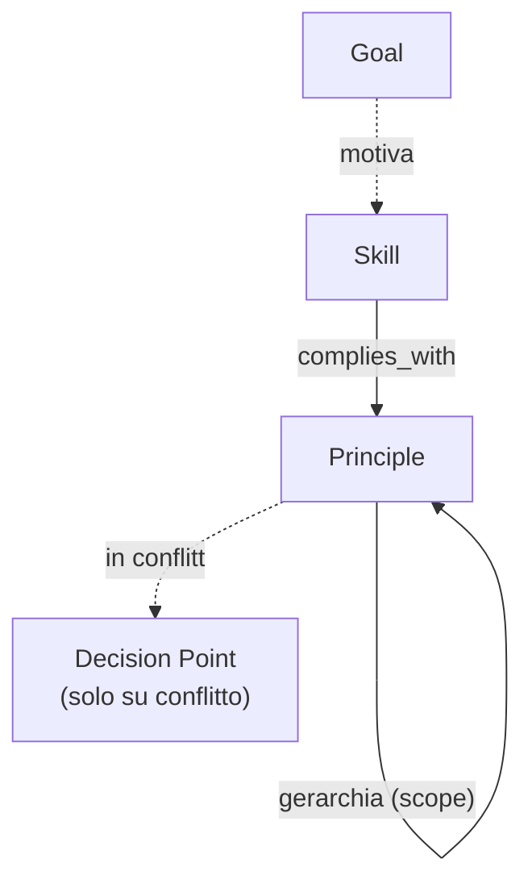
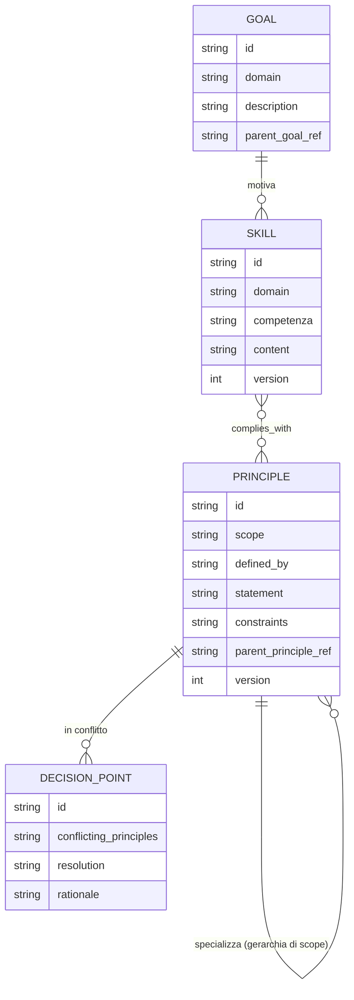

# Contextual Memory Metagraph

> Documento modulare dell'infrastruttura APM. Per la visione d'insieme, l'architettura a tre grafi e le considerazioni di compliance globale, vedi il documento master [APM](./APM.md). Per la distinzione concettuale sintetica rispetto al Process Metagraph, vedi la tabella in APM.md §1.1.
>
> **Nota di scope:** questo documento descrive il *modello concettuale* dei nodi e delle relazioni. Non entra nel merito di come le primitive vengano gestite operativamente (es. tramite skill dedicate, interfacce grafiche, o altri strumenti applicativi): quella è una scelta demandata al layer software sottostante, fuori dallo scope di questo manifesto.

La Contextual Memory Metagraph rappresenta lo strato logico-procedurale dell'infrastruttura APM. Mentre il Process Metagraph registra *cosa* è accaduto (il lineage fattuale), la Contextual Memory Metagraph cataloga *perché* è accaduto e *come* è stato deciso, fornendo il contesto logico e la traccia di ragionamento dietro ogni azione.

---

## 1. Responsabilità e Organizzazione

La Contextual Memory Metagraph si organizza attorno a **tre soli nodi concettuali**, ciascuno responsabile di un layer distinto, più un nodo di raccordo riservato ai casi di conflitto:

- **Goal**: rappresenta l'intenzione a monte di un processo, cosa si voleva ottenere. Se serve una gerarchia, è un attributo interno del nodo stesso (un Goal può referenziare un `parent_goal`).
- **Principle**: rappresenta un principio di governance (una regola, una policy), organizzato in una **gerarchia per scope e per chi lo ha definito** (§2). Porta opzionalmente i vincoli operativi che lo caratterizzano.
- **Skill**: rappresenta la competenza applicata (umana o agentica) per eseguire un'azione, in conformità con i principi in vigore nel suo scope; deve essere usata per una specifica procedura.
- **Decision Point**: nodo di raccordo riservato ai soli casi di **conflitto tra principi** (§3) — non un log generico di ogni decisione presa.

---

## 2. Gerarchia dei Principi

I Principle non sono nodi piatti e isolati: sono organizzati **gerarchicamente in base a chi li ha definiti e a quale scope li rende validi**. Un principio di scope più ampio vincola tutti gli scope sottostanti; uno di scope più ristretto può solo specializzare o restringere ulteriormente ciò che uno scope superiore già impone, mai contraddirlo.

Non entriamo qui nel dettaglio implementativo dei livelli possibili (potrebbero essere due, tre o più, a seconda dell'organizzazione): il concetto invariante è che **ogni Principle porta con sé chi lo ha definito e in quale scope è valido**, e le Skill devono adeguarsi alla gerarchia di principi rilevante per il proprio contesto.

> **Nota applicativa, gerarchia dei principi:** il management definisce un principio valido sempre, a livello globale (es. "riservatezza dei dati clienti"). Il team incaricato di un progetto definisce, sotto quel principio, delle proprie linee guida operative più specifiche per il proprio ambito di lavoro. Ogni membro del team dovrà rispettare entrambi i livelli, e adeguare le proprie Skill di conseguenza, in base alla gerarchia di principi applicabile al proprio scope.

---

## 3. Decision Point: risoluzione dei conflitti tra Principi

A differenza di una prima formulazione, il Decision Point **non cattura più ogni decisione critica in generale**. Il suo scope è ristretto ai soli casi in cui due o più Principle applicabili allo stesso scope entrano in conflitto tra loro (es. un principio di team che sembra contraddire un principio globale, o due principi dello stesso livello con requisiti incompatibili).

In questi casi, il Decision Point registra:
- quali Principle sono in conflitto;
- quale risoluzione è stata scelta (quale principio prevale, o come sono stati conciliati);
- il razionale della scelta.

Fuori da questo scenario, non viene creato alcun Decision Point: l'assenza di un nodo di questo tipo significa semplicemente che i principi applicabili non erano in conflitto.

> **Nota applicativa, conflitto tra principi:** un principio di team richiede tempi di consegna rapidi; il principio globale sulla sicurezza dei dati impone una revisione obbligatoria che allunga i tempi. Il Decision Point referenziato da entrambi registra che, in questo caso, il principio globale sulla sicurezza prevale, e documenta il compromesso adottato sui tempi di consegna.

---

## 4. Relazioni tra Contextual Memory Metagraph e Process Metagraph

I due grafi restano strutturalmente separati: un Process può referenziare i nodi della Contextual Memory Metagraph, non li contiene, almeno a livello concettuale.

- **Process → Goal**: ogni Process, o una Process Trajectory nel suo insieme, può referenziare il Goal che lo ha originato.
- **Process → Skill**: il Process referenzia la Skill impiegata per la sua esecuzione; la procedura risolta è già leggibile come attributo di quella Skill, senza query aggiuntive.
- **Process → Principle**: il Process referenzia il Principle (o la catena gerarchica di Principle) sotto la cui governance opera.
- **Decision Point sui rami divergenti**: quando dal Process Metagraph emergono rami `SUPERSEDES` paralleli e indipendenti (rollback, branch concorrenti) originati da un conflitto tra principi applicabili, il punto di divergenza può referenziare il Decision Point che ha risolto quel conflitto — cosa che il Process Metagraph, per costruzione, non registra mai.

---

## 5. Interrogazioni e Use Case

- **Auditing logico**: "Quale principio ha guidato questa decisione?" — dal Process/Skill al Principle applicabile, risalendo la gerarchia se necessario.
- **Learning**: "Quale skill è stata utilizzata in questo contesto, e per quale procedura?" — la Skill referenziata porta già l'informazione della procedura risolta.
- **Troubleshooting**: "Quale era l'intento originale del processo?" — risale dal Process al Goal referenziato.
- **Governance**: "Quali skill sono conformi al principio P?" — query inversa sulla relazione `complies_with` tra Skill e Principle.
- **Conflict analysis**: "Perché in questo caso ha prevalso il principio A sul principio B?" — il Decision Point referenziato fornisce il razionale della risoluzione.

---

## 6. Potenziale Unificazione e Sistemi Interconnessi

Process Metagraph e Contextual Memory Metagraph restano concettualmente distinti ma non necessariamente su infrastrutture fisicamente separate. Il manifesto non impone una scelta implementativa, ma delinea tre opzioni con trade-off differenti, da valutare in base alla scala e alla governance del progetto:

**Opzione A — Integrazione completa in un grafo unificato:** Process, Entity e i nodi della Contextual Memory Metagraph convivono nello stesso motore a grafo, con tipi di nodo distinti ma query cross-grafo native. Massimizza la facilità di interrogazione congiunta ("cosa e perché" in una sola query), ma rischia di creare confusione e aumentare la complessità, e può far filtrare la semantica logico-procedurale, evolutiva per natura, dentro il core rigido e immutabile del protocollo.

**Opzione B — Integrazione parziale tramite edge di referenza** (l'approccio illustrato negli esempi di questo capitolo): i due grafi restano fisicamente distinti, ciascuno con il proprio ciclo di vita, collegati da archi di riferimento espliciti (Process → Decision Point, Process → Goal, ecc.). Preserva l'immutabilità del Process Metagraph e la libertà evolutiva della Contextual Memory Metagraph, al costo di una query cross-grafo che deve attraversare esplicitamente il collegamento.

**Opzione C — Mantenimento della separazione con sistema di linking esplicito:** i due grafi non condividono nemmeno l'infrastruttura di riferimento diretto; il collegamento avviene tramite un livello applicativo esterno (un indice, un servizio di lookup) che mappa identificatori tra i due sistemi. Massima indipendenza operativa e possibilità di adottare approcci diversi per i due grafi, al prezzo di una minore garanzia di consistenza referenziale tra i due lati del link.

La scelta tra le tre opzioni non è normata dal manifesto: è una decisione architetturale del reparto o del team che implementa l'infrastruttura, coerente con il principio generale per cui il come implementare resta demandato a un momento successivo, mentre il manifesto fissa solo l'invariante concettuale — la netta distinzione di responsabilità tra cosa è accaduto e perché è accaduto.

---

## 7. Diagramma Concettuale Informativo

Tre nodi, una relazione M:N esplicita (`Skill complies_with Principle`, l'unica che davvero serve renderla visibile), una relazione ricorsiva su Principle per la gerarchia di scope, e il Decision Point come raccordo riservato ai soli conflitti. Procedure e constraint non spariscono concettualmente: restano leggibili come attributi, semplicemente non guadagnano lo status di nodo autonomo.

---

## Appendice: Filosofie di Design Alternative (placeholder)

> Le proposte seguenti sono state raccolte durante la discussione come possibili direzioni alternative per strutturare questo modulo. Sono lasciate come placeholder da espandere: avere più filosofie a confronto aiuta a non fossilizzarsi su un'unica scelta architetturale.

### A) Modello hub-based (baseline storica)

Goal / Principle / Skill come nodi, Decision Point come hub che li referenzia tutti per ogni decisione rilevante, non solo per i conflitti. *[Da espandere]*

### B) Modello a eccezione ("silenzio = conformità")

Principle e Skill esistono come nodi. Non esiste un nodo di raccordo per ogni decisione: la conformità è assunta di default e non tracciata. Un nodo di tipo `Deviation` esiste solo quando un'azione si discosta da un principio o da una skill standard, ed è obbligatorio in quel caso. *[Da espandere]*

### C) Modello a livelli (tiered), esteso dalla gerarchia di Principle anche a Goal e Skill

Ogni nodo (non solo Principle) porta un attributo `tier` esplicito (es. protocollo → dominio → progetto), con regole di override tra livelli. Riusa coerentemente lo stesso principio "poco fisso, molto evolutivo" già applicato altrove nell'infrastruttura. *[Da espandere]*

### D) Modello a piani separati (Control/Data Plane anche qui)

Applica al Contextual Memory Metagraph la stessa separazione già usata per il Process Metagraph: un grafo sottile con solo ID, tipo, versione e relazioni, mentre il contenuto vero e proprio (testo del principio, procedura della skill, razionale della decisione) vive come documento versionato a parte, referenziato da un puntatore. *[Da espandere]*

### E) Modello Skill-centrico invece che Decision-centrico

La conformità (`complies_with Principle`) e il goal servito diventano attributi diretti sull'arco che collega un Process alla Skill utilizzata, invece che passare da un nodo terzo. Il Decision Point sopravvive solo per i casi realmente contesi. *[Da espandere]*