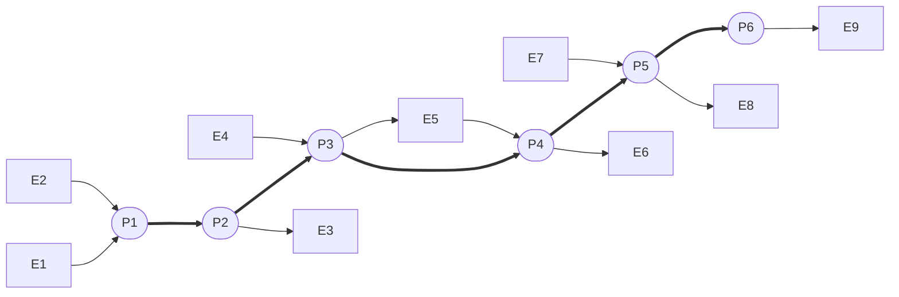
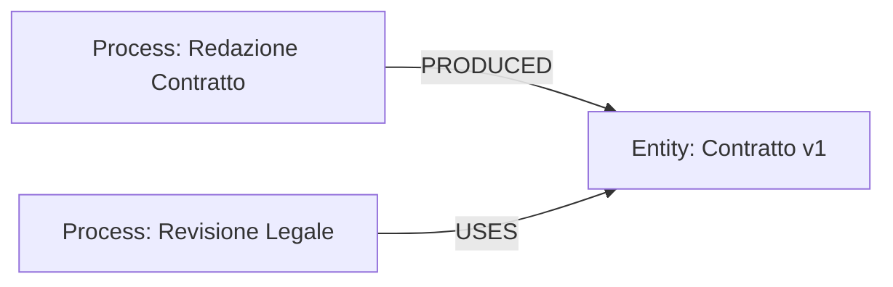
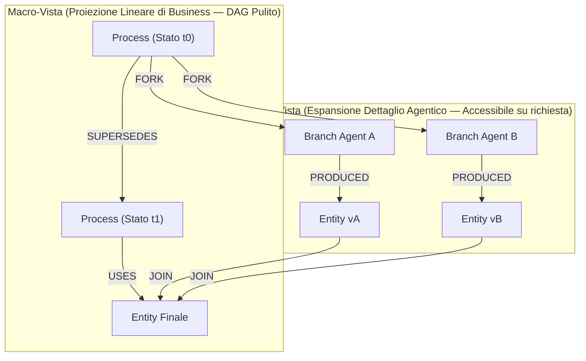
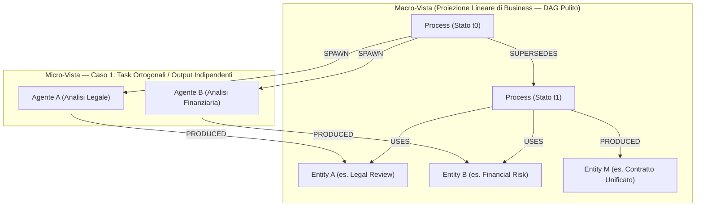
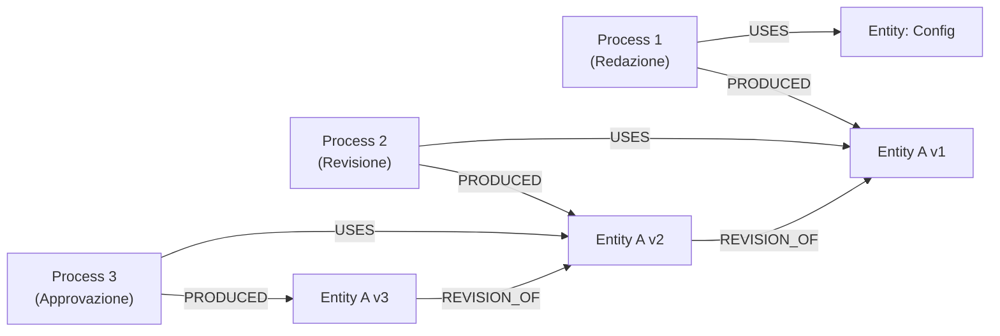
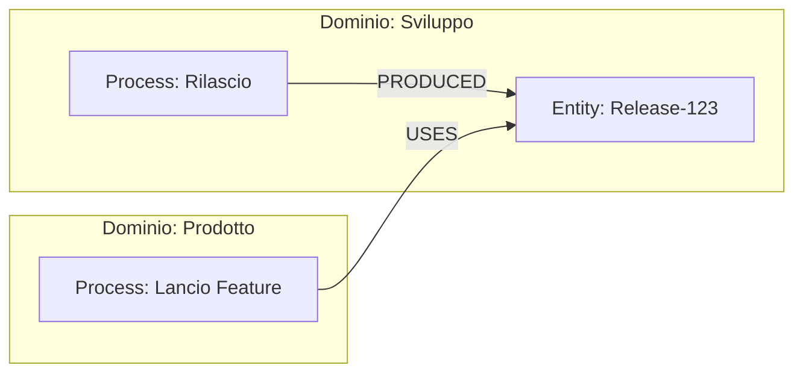
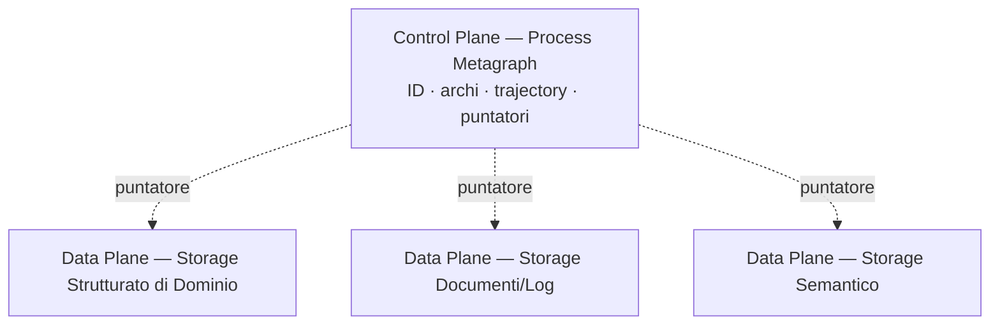
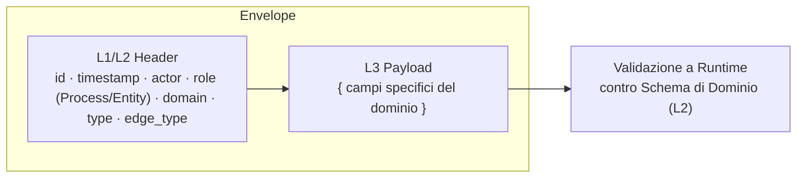
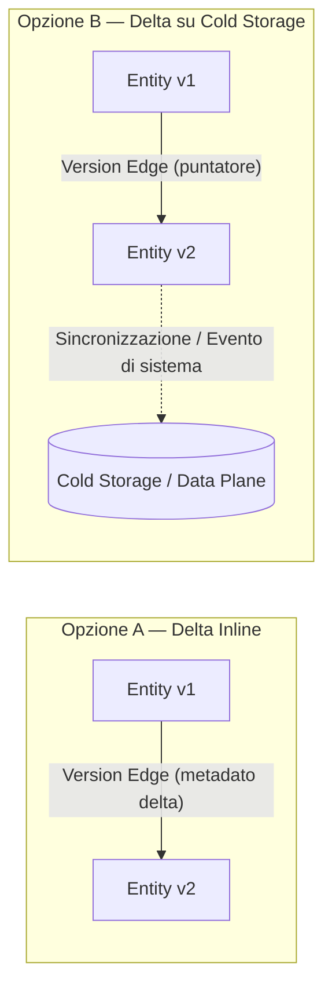

# Process Metagraph

> Documento modulare dell'infrastruttura APM. Per la visione d'insieme, l'architettura a tre grafi e le considerazioni di compliance globale, vedi il documento master [APM](./APM.md).

Il Process Metagraph è il cuore tecnico del protocollo APM: il grafo di *lineage* immutabile e append-only che traccia l'evoluzione dei processi, cosa è stato consumato o prodotto, e chi lo ha eseguito. Risponde al **COSA** e al **CHI**.

---

## 1. Glossario Essenziale ProcessMetagraph

| Termine | Significato |
| --- | --- |
| **Process Node** | Non un dato statico, ma la rappresentazione di un **agente esecutivo reattivo** in un istante *t* (equivalente a un'Activity PROV-O): è simultaneamente l'azione e il suo motore (procedura in esecuzione). Il suo "corpo" — versione della procedura, riferimento del job — non è un'Entity del grafo: è parte costitutiva del Process stesso, non un dato che consuma o produce. Immutabile: ogni cambio di stato crea un nuovo nodo. |
| **Entity Node** | Un dato (input, output o arricchimento) collegato a un Process tramite `USES` o `PRODUCED`. |
| **Process Edge (`SUPERSEDES`)** | L'arco primario che fa avanzare la linea temporale standard di un processo da uno stato al successivo. Traccia sia l'evoluzione dell'attività che l'evoluzione della logica che la governa. Versiona il **Process**. |
| **Entity Edge (`USES` / `PRODUCED`)** | Collega una Entity a un Process: cosa è stato consumato, cosa è stato generato. |
| **Spawn Edge (`SPAWN`)** | Collega un Process all'esecuzione di un subprocesso delegato in background, compattato in un log unico. |
| **Fork Edge (`FORK`)** | Arco di ramificazione esplicita da un Process verso N branch concorrenti e isolati (traiettorie parallele). |
| **Join/Merge Edge (`JOIN`)** | Arco di convergenza che unisce N Entity prodotte da branch concorrenti in un'unica Entity finale dello stesso tipo delle sorgenti. Formalmente agisce come relazione N-a-1 (Hyperedge relazionale) per consolidare i risultati. |
| **Conflict Edge (`CONFLICT`)** | Arco che rende esplicita nel grafo una collisione tra scritture concorrenti incompatibili sulla stessa Entity logica. |
| **Derivation Edge (`DERIVED_FROM`)** | Proprietà di base che asserisce che un'entità è trasformata, aggiornata o costruita a partire da un'entità preesistente (es. un dataset ripulito derivato da uno grezzo). |
| **Versioning Edge (`REVISION_OF`)** | Proprietà più specifica, sotto-relazione stretta di `DERIVED_FROM`. Indica che un'entità è una versione rivista di un'entità precedente, tipicamente nei casi in cui le entità cambiano nel tempo mantenendo una linea evolutiva diretta. |
| **Actor** | Proprietà presente sull'arco che indica l'identità dell'esecutore che ha effettuato la scrittura. |
| **`acting_on_behalf_of`** | Proprietà opzionale sull'arco: indica l'attore per conto del quale è stata eseguita l'azione. |
| **Process Trajectory** | La catena ordinata di Process Node collegati da `SUPERSEDES`: rappresenta l'evoluzione del Process stesso e della logica esecutiva a cui è ancorato, non il versioning di un'Entity dati (gestito separatamente da `REVISION_OF`, §6). |

---

## 2. Supersession Graph

Vediamo la forma più semplice e intuitiva della *Process Trajectory*: una lunga catena orizzontale di Process, come i segmenti del corpo di un millepiede. La "colonna vertebrale" del millepiede è la sequenza dei `SUPERSEDES` (arco più spesso): rappresenta il tempo che avanza, un passo dopo l'altro. Da ogni segmento si diramano delle "zampe", gli archi `USES`/`PRODUCED` (arco più sottile) verso i dati che quel passo ha consumato o generato.

Non serve altro per capire il grafo di processo a livello macro:

- Ogni **quadrato Eᵢ** è un dato, un'Entity usata o prodotta in un certo istante.
- Ogni **Pᵢ** è un passo del processo, un Process al tempo *i*.
- Gli archi lungo la spina dorsale sono **sempre e solo** `SUPERSEDES`: non esiste altro modo di avanzare nel tempo.
- Le zampe sono **sempre e solo** `USES` o `PRODUCED`: non esiste altro modo per un processo di toccare un dato.

Qualunque sia la complessità reale dietro ogni Pᵢ (una persona, un agente, un intero team), **da lontano** il processo resta sempre leggibile come questa fila ordinata e senza cicli. È la stessa proiezione descritta più in dettaglio in §4 come Macro-Vista.

---

## 3. Ruoli Contestuali delle Entity

Un'Entity non ha una tipologia rigida di utilizzo: il ruolo è strettamente relativo all'arco che la collega a un Process. Lo stesso oggetto dati può essere l'output di una fase di redazione e l'input di una fase di revisione senza subire alcuna riassegnazione strutturale.

---

## 4. Tracciamento Agentico: la Proiezione a Solido DAG

La collaborazione con agenti AI richiede un modello flessibile che non vincoli l'orchestrazione a una forma rigida predefinita. **Non esiste il requisito di un lineage omogeneo**: l'infrastruttura si adatta a scenari che vanno dalla delega lineare semplice a complessi grafi di esecuzione concorrente.

Nonostante l'orchestrazione agentica introduca rami paralleli e convergenze, **il metamodello garantisce l'assenza assoluta di cicli temporali (Acyclic Flow)**.

### 4.1 Le Primitive di Delega e Concorrenza

* **`SPAWN` (Delega lineare compattata):** usato quando un agente riceve un sotto-task delimitato. L'intera esecuzione interna (ragionamenti, chiamate a strumenti) vive isolata ed è compattata in un log di esecuzione archiviato nel Data Plane. Il metagrafo vede un singolo nodo e l'Entity di output prodotta.
* **`FORK` (Concorrenza esplicita):** usato quando l'orchestrazione richiede la ramificazione in traiettorie parallele visibili a livello di metagrafo. Ogni ramo opera in una propria **sandbox concettuale**, elaborando una propria versione/ipotesi di lavoro in base al suo specifico obiettivo.
* **`JOIN` (Convergenza relazionale / Hyperedge):** quando i rami concorrenti debbono riconvergere, il `JOIN` consolida le Entity sorgenti ($E_A, E_B$) in un'unica Entity finale $E_{final}$ dello stesso tipo. Dal punto di vista del metamodello, il `JOIN` agisce come una relazione di convergenza N-a-1 tra Entity (strutturalmente equivalente a un Hyperedge sulle relazioni), senza introdurre nodi di tipo "Process Collettore" inutili.
* **`CONFLICT`:** evidenzia esplicitamente una collisione non riconciliabile tra rami concorrenti, instradandola a una gestione dedicata o alla decisione umana.

La scelta tra usare `SPAWN` o `FORK` può essere determinata a priori dalle regole del dominio o decisa dinamicamente dall'agente orchestratore. L'invariante di protocollo è una sola: **qualsiasi processo agentico in background deve essere tracciato e riconducibile alla sua origine.**

> **Nota applicativa, delega concorrente:** un Process "Valutazione RFP Fornitore" apre due `SPAWN` verso un agente di analisi legale e un agente di analisi finanziaria, ciascuno isolato nella propria esecuzione. I due output (`Entity: Parere Legale`, `Entity: Rischio Finanziario`) confluiscono tramite `JOIN` in un'unica `Entity: Valutazione Consolidata`, senza introdurre un Process "collettore" superfluo.

### 4.2 Proiezione per livelli di astrazione (Macro vs. Micro)

Per evitare che l'utente finale o il revisore di business vengano sommersi dalla complessità delle chiamate agentiche intermedie, APM applica il principio di **Proiezione del Grafo**:

1. **Macro-Vista (Linear Process Projection):** è la proiezione del Process Graph ottenuta rimuovendo il sotto-grafo raggiungibile a partire dagli archi `SPAWN` e `FORK`; ogni nodo e arco diramato da quei ponti viene eliminato dalla vista. Ciò che resta è un **DAG lineare e pulito**, composto solo da Process collegati da `SUPERSEDES` e dalle Entity terminali (`USES`/`PRODUCED`). Questo è il livello mostrato all'utente o all'auditor per validare il risultato di business (*"Cosa è stato fatto e da chi"*).
2. **Micro-Vista (Agentic Workflow Expansion):** i rami generati da `SPAWN` e `FORK` costituiscono la traccia di dettaglio. Vengono consultati o espansi **solo su richiesta esplicita** (es. controlli di conformità approfonditi, debugging, analisi di alignment degli agenti).

### 4.3 Ancoraggio del Process a una Logica Esecutiva

Ogni Process Node è **indissolubilmente ancorato a uno stato di logica esecutiva**: la procedura che lo governa. Questo ancoraggio non è una Entity separata, ma è il Process stesso che lo rappresenta. Quando la logica cambia, il cambiamento è registrato tramite un nuovo arco `SUPERSEDES`, che traccia simultaneamente l'avanzamento dell'attività e l'evoluzione della logica che l'ha governata.

Il caso più articolato — quando da un Process divergono **molteplici rami `SUPERSEDES`** (rollback, branch paralleli, direzioni alternative) — è di natura fortemente implementativa e sarà trattato in dettaglio in un documento tecnico dedicato, non ancora redatto.

### 4.4 Proprietà di Statelessness e Tracciabilità

Il Process Metagraph è **intrinsecamente stateless**: non mantiene alcuno stato interno persistente tra le transazioni. Ogni nodo rappresenta un'istantanea atomica dell'esecuzione (attività + logica alla quale è ancorata), e la continuità del processo è rappresentata esclusivamente dagli archi `SUPERSEDES` che collegano un nodo al successivo nel tempo.

L'assenza di cicli è garantita da:
- Ogni arco `SUPERSEDES` avanza in una sola direzione temporale.
- I branch paralleli (`FORK`, `CONFLICT`) rimangono isolati senza riconnessioni circolari.
- Il `JOIN` converte Entity divergenti in una unica Entity, senza re-introdurre cicli nei Process.
- Ogni Process, sebbene ancorato a una logica che può evolvere, segue una timeline lineare determinata dal suo stato di riferimento.

---

## 5. Versioning e Gestione dei Delta

Un cambio di stato può necessitare del solo tracciamento della supersessione (`SUPERSEDES`) o della registrazione puntuale di *cosa* è cambiato. La relazione di versione è gestita dal **Version Edge**.

Un esempio minimale mostra come si versiona un'Entity nel tempo: tre Process in sequenza leggono, producono e revisionano la stessa Entity logica, collegando le versioni successive tramite l'arco `REVISION_OF`.

Ogni `REVISION_OF` collega la nuova versione dell'Entity a quella immediatamente precedente; il `SUPERSEDES` tra i Process traccia invece, separatamente, l'avanzamento del processo stesso. Le due catene — quella di versioning delle Entity e quella dei Process — avanzano in parallelo ma restano concettualmente distinte.

Il delta del cambiamento risponde alla netta separazione tra **Control Plane** (Process Metagraph) e **Data Plane** (storage di dominio); le strategie con cui questo delta può essere fisicamente archiviato sono descritte in Appendice.

---

## 6. Unificazione Cross-dominio

Domini differenti non condividono i propri modelli dati interni, ma condividono lo **spazio degli identificatori canonici**. Due processi di reparti diversi si collegano in modo trasparente e transitivo referenziando la medesima Entity immutabile.

> **Nota applicativa, cross-dominio Dev/Prodotto:** il reparto Sviluppo produce `Entity: Release-123` al termine di un rilascio. Il reparto Prodotto, senza conoscere nulla dello schema interno di Sviluppo, referenzia la stessa Entity nel proprio Process "Lancio Feature". I due domini restano disaccoppiati nei modelli dati, ma transitivamente collegati tramite l'identificatore canonico condiviso.

---

## 7. Control Plane vs Data Plane

Il Process Metagraph agisce come **Control Plane**: un'infrastruttura ad alta velocità che contiene unicamente identificativi, archi, attributi dell'envelope e puntatori. Il contenuto effettivo (payload pesanti, log estesi di esecuzione, documenti) risiede nel **Data Plane**.

> **Nota applicativa, integrazione con sistema legacy:** un componente applicativo osserva un evento di scrittura su un sistema legacy HR. Legge il record modificato, lo mappa a un'Entity di dominio (`domain: HR`, `type: Contratto`) e scrive nel Control Plane solo l'envelope L1/L2 con puntatore; il contenuto integrale del record resta nel Data Plane (il sistema legacy stesso, referenziato). Nessun payload pesante attraversa il Process Metagraph.

---

## 8. Envelope del Protocollo

In linea con la ttruttura comunicativa del file [APM](APM.md), ogni transazione sul metagrafo avviene tramite un **Envelope** rigido nel tracciato L1, combinato con un payload L3 libero ma validato:

---

## Appendice A: Strategie di Delta Storage — Inline vs Cold Storage

Il delta del cambiamento risponde alla netta separazione tra **Control Plane** (Process Metagraph) e **Data Plane** (storage di dominio):

* **Delta Inline (Control Plane):** per variazioni strutturali minime e metadati compatti, il delta risiede direttamente sull'arco nel metagrafo.
* **Delta in Cold Storage (Data Plane):** per modifiche estese o documenti complessi, l'arco contiene la relazione logica e il puntatore ai dati nello storage esterno.

Le policy su dove archiviare i delta (soglie di dimensione, frequenza) e l'eventuale reattività tramite eventi di sistema sono scelte operative da definire in fase di progettazione dell'infrastruttura, in base ai requisiti specifici.

> **Nota:** i casi di divergenza multipla di `SUPERSEDES` (rollback, branch paralleli, direzioni alternative) richiamati in §5.1 non sono ancora stati approfonditi a livello implementativo in questo documento e saranno oggetto di un'appendice tecnica dedicata.